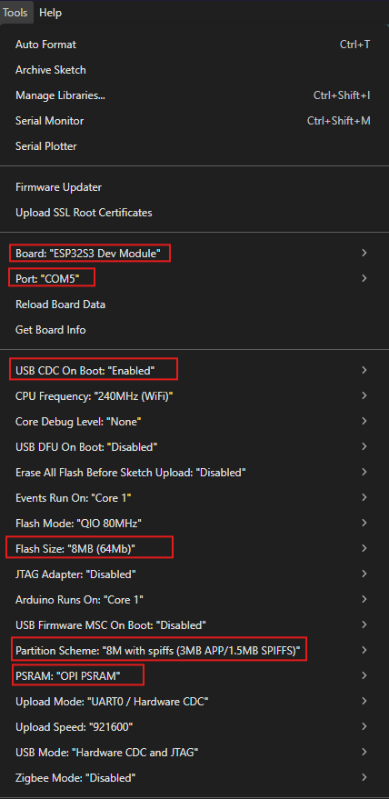

# YD-ESP32-S3-EYE (espressif_esp32s3_eye V.2.2)

Proyek eksplorasi penuh YD-ESP32-S3-EYE — mencakup pengujian semua peripheral onboard (SD Card, LED, Tombol, Mikrofon I2S, Kamera OV2640, LCD ST7789V) menggunakan Arduino IDE dan CircuitPython.

----

## Arduino IDE Settings



| Setting              | Nilai                            |
|----------------------|----------------------------------|
| Board                | ESP32S3 Dev Module               |
| Port                 | COM5 (sesuaikan)                 |
| Upload Speed         | 921600                           |
| USB Mode             | Hardware CDC and JTAG            |
| PSRAM                | OPI PSRAM                        |
| Partition Scheme     | Huge APP (3MB No OTA/1MB SPIFFS) — untuk kamera |

---

## Source Code — Daftar Program

### Arduino (source-code-arduino/)

| No | Folder | Deskripsi | Platform |
|----|--------|-----------|----------|
| 01 | [01-test-sdcard](source-code-arduino/01-test-sdcard/) | Test baca/tulis microSD Card via SDMMC | Arduino |
| 02 | [02-test-led-button](source-code-arduino/02-test-led-button/) | Test LED onboard + tombol UP/DOWN/PLAY/MENU/BOOT | Arduino |
| 03 | [03-test-mic](source-code-arduino/03-test-mic/) | Monitoring mikrofon I2S — bar graph di Serial Monitor | Arduino |
| 04 | [04-mic-stream](source-code-arduino/04-mic-stream/) | Stream audio ke Python — waveform + FFT realtime | Arduino + Python |
| 05 | [05-mic-record](source-code-arduino/05-mic-record/) | Rekam audio ke WAV + playback lewat GUI Python | Arduino + Python |
| 06 | [06-camera-stream](source-code-arduino/06-camera-stream/) | Live stream kamera ke browser via WiFi AP — auto-detect sensor | Arduino |
| 07 | [07-lcd-display](source-code-arduino/07-lcd-display/) | Demo slideshow LCD 1.3" ST7789V — warna, bentuk, animasi | Arduino |
| 08 | [08-lcd-hello](source-code-arduino/08-lcd-hello/) | Test minimal LCD ST7789V — tampilkan "Halo Apa Kabar" | Arduino |
| 09a | [09-i2c-scanner](source-code-arduino/09-i2c-scanner/) | Scan bus I2C — deteksi perangkat & alamat | Arduino |
| 09b | [09-accelerometer](source-code-arduino/09-accelerometer/) | Baca akselerometer 3-axis QMA7981 via I2C → Serial UART | Arduino |
| 10 | [10-imu-cube](source-code-arduino/10-imu-cube/) | Kubus wireframe 3D di LCD yang mengikuti gerakan IMU | Arduino |

### CircuitPython (circuit-python/)

| No | File | Deskripsi | Platform |
|----|------|-----------|----------|
| CP1 | [cpS3EYE_espcamera_displayio.py](circuit-python/circuit-python-code/cpS3EYE_espcamera_displayio.py) | Kamera OV2640 via espcamera + tampil di LCD | CircuitPython |
| CP2 | [cpyS3EYE_LCD_color.py](circuit-python/circuit-python-code/cpyS3EYE_LCD_color.py) | Test warna LCD + animasi teks | CircuitPython |
| CP3 | [cpyS3EYE_turtle.py](circuit-python/circuit-python-code/cpyS3EYE_turtle.py) | Turtle graphics di LCD ESP32 | CircuitPython |
| CP4 | [py_turtle.py](circuit-python/circuit-python-code/py_turtle.py) | Turtle graphics di Desktop Python (pembanding) | Python 3 |

> Setiap folder memiliki `README.md` dengan penjelasan lengkap: pendahuluan, pin definition, cara kerja, alur berpikir, hasil, library, instalasi, dan troubleshooting.

---

## Catatan Hardware Penting

### LCD ST7789V — Backlight (GPIO 48)

Backlight menggunakan P-channel MOSFET (Q2 = AO3401A), bukan N-channel.

| Kode | Efek |
|------|------|
| `digitalWrite(48, LOW)` | Backlight **NYALA** |
| `digitalWrite(48, HIGH)` | Backlight **MATI** |

Intuisi N-channel (HIGH = ON) **tidak berlaku** di sini. Lihat [07-lcd-display/README.md](source-code-arduino/07-lcd-display/README.md) untuk penjelasan lengkap.

### LCD ST7789V — Cold Power-On (USB baru di-colokin)

Pada cold power-on, GPIO44 (LCD CS, active-LOW) mulai dari 0V → LCD ter-select sebelum firmware jalan → SPI state machine corrupt → layar hitam permanen. Fix wajib di `setup()`:

```cpp
#include <esp_system.h>
if (esp_reset_reason() == ESP_RST_POWERON) { delay(200); ESP.restart(); }
```

---

## Ringkasan Pin Definition Board

### Kamera OV2640
| Sinyal | GPIO | Sinyal | GPIO |
|--------|------|--------|------|
| XCLK | 15 | D0 (Y2) | 11 |
| SIOD | 4 | D1 (Y3) | 9 |
| SIOC | 5 | D2 (Y4) | 8 |
| VSYNC | 6 | D3 (Y5) | 10 |
| HREF | 7 | D4 (Y6) | 12 |
| PCLK | 13 | D5 (Y7) | 18 |
| PWDN | — | D6 (Y8) | 17 |
| RESET | — | D7 (Y9) | 16 |

### Mikrofon I2S (MSM261S4030H0)
| Sinyal | GPIO |
|--------|------|
| WS (LRCK) | 42 |
| SCK (BCK) | 41 |
| SD (DATA) | 2 |

### LCD ST7789V 240×240
| Sinyal | GPIO |
|--------|------|
| MOSI | 47 |
| SCK | 21 |
| CS | 44 |
| DC | 43 |
| RST | — (terhubung ke EN board) |
| BL | 48 (P-channel: LOW=ON) |

### SD Card (SDMMC 1-bit)
| Sinyal | GPIO |
|--------|------|
| CLK | 39 |
| CMD | 38 |
| D0 | 40 |

### IMU — Akselerometer QMA7981
| Sinyal | GPIO | Keterangan |
|--------|------|------------|
| SDA | 4 | Shared dengan Camera SIOD |
| SCL | 5 | Shared dengan Camera SIOC |
| I2C Addr | 0x12 | Fixed |
| Chip ID | 0xE7 | Revisi QMA7981 (bukan 0xE8 standard) |

### LED & Tombol
| Komponen | GPIO | Keterangan |
|----------|------|------------|
| LED | 3 | Active HIGH |
| BOOT Button | 0 | Active LOW (strapping) |
| Function Button | 1 | ADC — MENU/PLAY/DN-/UP+ |

### Battery Voltage Detect
| Sinyal | GPIO |
|--------|------|
| VBAT_DET | 14 (ADC) |

---

## GPIO Master Map

Peta lengkap semua GPIO ESP32-S3 pada board ini.

### GPIO Terpakai Onboard

| GPIO | Fungsi | Peripheral | Mode |
|------|--------|------------|------|
| 0 | BOOT button | Button | Input, strapping |
| 1 | ADC button array | MENU/PLAY/DN-/UP+ | ADC input |
| 2 | I2S MIC DATA (SD) | Mikrofon | I2S |
| 3 | LED hijau | LED | Output |
| 4 | I2C SDA | Camera SIOD + IMU QMA7981 | I2C (shared) |
| 5 | I2C SCL | Camera SIOC + IMU QMA7981 | I2C (shared) |
| 6 | Camera VSYNC | OV2640 | DVP |
| 7 | Camera HREF | OV2640 | DVP |
| 8 | Camera D2 (Y4) | OV2640 | DVP |
| 9 | Camera D1 (Y3) | OV2640 | DVP |
| 10 | Camera D3 (Y5) | OV2640 | DVP |
| 11 | Camera D0 (Y2) | OV2640 | DVP |
| 12 | Camera D4 (Y6) | OV2640 | DVP |
| 13 | Camera PCLK | OV2640 | DVP |
| 14 | Battery ADC | VBAT_DET | ADC input |
| 15 | Camera XCLK | OV2640 | DVP clock |
| 16 | Camera D7 (Y9) | OV2640 | DVP |
| 17 | Camera D6 (Y8) | OV2640 | DVP |
| 18 | Camera D5 (Y7) | OV2640 | DVP |
| 19 | USB D- | USB hardware | Internal |
| 20 | USB D+ | USB hardware | Internal |
| 21 | LCD SCK | ST7789V | SPI |
| 26–37 | Flash / PSRAM | Internal | **Tidak bisa dipakai** |
| 38 | SD Card CMD | SDMMC | SDMMC |
| 39 | SD Card CLK | SDMMC | SDMMC |
| 40 | SD Card D0 | SDMMC | SDMMC |
| 41 | I2S MIC BCK (SCK) | Mikrofon | I2S |
| 42 | I2S MIC LRCK (WS) | Mikrofon | I2S |
| 43 | LCD DC | ST7789V (juga UART0 TX) | SPI / CDC |
| 44 | LCD CS | ST7789V (juga UART0 RX) | SPI / CDC |
| 47 | LCD MOSI | ST7789V | SPI |
| 48 | LCD Backlight | P-ch MOSFET AO3401A | Output (LOW=ON) |

### GPIO Bebas untuk User

| GPIO | Lokasi | Catatan |
|------|--------|---------|
| **45** | Header sub-board | Strapping pin — bebas dipakai, tersedia di konektor |
| **46** | Header sub-board | Strapping pin — bebas dipakai, tersedia di konektor |

### GPIO Kondisional (bebas jika peripheral tidak dipakai)

| GPIO | Peripheral Default | Syarat Bisa Dipakai |
|------|-------------------|---------------------|
| 0 | BOOT button | Aman untuk I/O, hati-hati saat boot (strapping LOW = download mode) |
| 1 | ADC button array | Bebas jika tombol tidak digunakan |
| 3 | LED hijau | Bebas jika LED tidak digunakan |
| 14 | Battery ADC | Bebas jika monitoring baterai tidak dibutuhkan |

> **Catatan strapping:** GPIO 0 dan 45 adalah strapping pin. Jangan dibiarkan float saat power-on — tambahkan pull-up/pull-down jika dipakai sebagai input.

---

## Firmware & Tools

| Folder | Isi |
|--------|-----|
| [manufaktur-firmware/](manufaktur-firmware/) | Firmware bawaan pabrik V2.2 + panduan flash |
| [circuit-python/](circuit-python/) | Instalasi CircuitPython + firmware + bundle library |
| [skematik/](skematik/) | Schematic resmi ESP32-S3-EYE V2.2 |

---

## Referensi

1. Schematic: [SCH_ESP32-S3-EYE-MB_20211201_V2.2.pdf](https://github.com/prusa3d/Prusa-Firmware-ESP32-Cam/blob/master/doc/ESP32-S3-EYE-22/SCH_ESP32-S3-EYE-MB_20211201_V2.2.pdf)
2. ESP32-S3-EYE Getting Started Guide: http://vcc-gnd.cn/vcc_gnd/esp-who/src/commit/b454739d3ea4221ca96e17f88293faf625da4ff5/docs/en/get-started/ESP32-S3-EYE_Getting_Started_Guide.md
3. CircuitPython firmware: https://circuitpython.org/board/espressif_esp32s3_eye/
