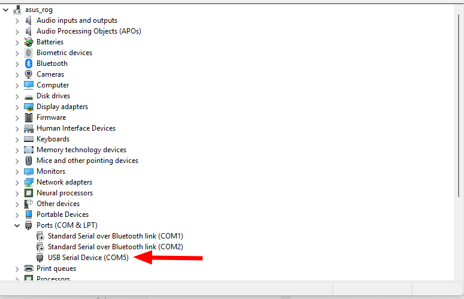

# Install circuit python on YD-ESP32-S3-EYE (espressif_esp32s3_eye)

langkahnya

1.  cek serial dulu lewat device manager untuk tahu portnya



2. download circuit python for eso32s3 eye di -> https://circuitpython.org/board/espressif_esp32s3_eye/

2. cek id pakai esptool
2. sesuaikan port dengan yang ad di device manager

```
esptool.exe --chip auto  --port COM5 chip-id
```

contoh tampilan

```bash
esptool v5.2.0
Connected to ESP32-S3 on COM5:
Chip type:          ESP32-S3 (QFN56) (revision v0.1)
Features:           Wi-Fi, BT 5 (LE), Dual Core + LP Core, 240MHz, Embedded PSRAM 8MB (AP_3v3)
Crystal frequency:  40MHz
USB mode:           USB-Serial/JTAG
MAC:                f4:12:fa:fb:29:ec

Stub flasher running.

Warning: ESP32-S3 has no chip ID. Reading MAC address instead.
MAC:                f4:12:fa:fb:29:ec

Hard resetting via RTS pin...
```

5. cek juga flash id

```
esptool.exe --chip auto  --port COM5 flash-id
```

contoh tampilan

```
esptool v5.2.0
Connected to ESP32-S3 on COM5:
Chip type:          ESP32-S3 (QFN56) (revision v0.1)
Features:           Wi-Fi, BT 5 (LE), Dual Core + LP Core, 240MHz, Embedded PSRAM 8MB (AP_3v3)
Crystal frequency:  40MHz
USB mode:           USB-Serial/JTAG
MAC:                f4:12:fa:fb:29:ec

Stub flasher running.

Flash Memory Information:
=========================
Manufacturer: c8
Device: 4017
Detected flash size: 8MB
Flash type set in eFuse: quad (4 data lines)
Flash voltage set by eFuse: 3.3V

Hard resetting via RTS pin...
```

6. Erase flash terlebih dahulu

```
esptool --chip esp32s3 --port COM5  erase-flash
```

6. hasilnya:

```
esptool v5.2.0
Connected to ESP32-S3 on COM5:
Chip type:          ESP32-S3 (QFN56) (revision v0.1)
Features:           Wi-Fi, BT 5 (LE), Dual Core + LP Core, 240MHz, Embedded PSRAM 8MB (AP_3v3)
Crystal frequency:  40MHz
USB mode:           USB-Serial/JTAG
MAC:                f4:12:fa:fb:29:ec

Stub flasher running.

Flash memory erased successfully in 8.7 seconds.
```

7. install firmware circuit python (stabil recommendd : adafruit-circuitpython-espressif_esp32s3_eye-en_US-8.2.8.bin)  yang bisa diunduh di:
   - [adafruit](https://adafruit-circuit-python.s3.amazonaws.com/bin/espressif_esp32s3_eye/en_US/adafruit-circuitpython-espressif_esp32s3_eye-en_US-8.2.8.bin)
8.  sini dengan syntax

```bash
esptool --chip esp32s3 --port COM5 --baud 460800 write-flash -z 0x0 .\adafruit-circuitpython-espressif_esp32s3_eye-en_US-8.2.8.bin
```

hasilnya:

```
(base) PS C:\Users\hardware\Documents\REPO-Github\YD-ESP32-S3-EYE\circuitpython-firmware> esptool --chip esp32s3 --port COM5 --baud 460800 write_flash -z 0x0 .\adafruit-circuitpython-espressif_esp32s3_eye-en_US-8.2.8.bin
Warning: Deprecated: Command 'write_flash' is deprecated. Use 'write-flash' instead.
esptool v5.2.0
Connected to ESP32-S3 on COM5:
Chip type:          ESP32-S3 (QFN56) (revision v0.1)
Features:           Wi-Fi, BT 5 (LE), Dual Core + LP Core, 240MHz, Embedded PSRAM 8MB (AP_3v3)
Crystal frequency:  40MHz
USB mode:           USB-Serial/JTAG
MAC:                f4:12:fa:fb:29:ec

Stub flasher running.
Changing baud rate to 460800...
Changed.

Configuring flash size...
Flash will be erased from 0x00000000 to 0x001d3fff...
Wrote 1916048 bytes (1278725 compressed) at 0x00000000 in 13.0 seconds (1175.4 kbit/s).
Hash of data verified.

Hard resetting via RTS pin...
(base) PS C:\Users\hardware\Documents\REPO-Github\YD-ESP32-S3-EYE\circuitpython-firmware>
```

----

## Referensi

- [espcamera exercise on YD-ESP32-S3](https://www.youtube.com/shorts/DOfPyqMIow0)

- [Install CircuitPython firmware on YD-ESP32-S3-EYE using esptool](https://www.youtube.com/watch?v=IQWlmotOsW8)
- [LCD/Color test on YD-ESP32-S3-EYE/CircuitPython 8](https://www.youtube.com/watch?v=C01ppf5P_fA)
- [YD-ESP32-S3-EYE/CircuitPython 8 read OV2640 camera using espcamera lib and display on LCD](https://www.youtube.com/watch?v=j36nwUPCdww)
- [YD-ESP32-S3-EYE by VCC-GND Studio](https://www.youtube.com/shorts/O_jRuQ1oojU)
- firmware https://adafruit-circuit-python.s3.amazonaws.com/index.html?prefix=bin/espressif_esp32s3_eye/en_US/
- [spesific firmware 8.2.8](https://adafruit-circuit-python.s3.amazonaws.com/bin/espressif_esp32s3_eye/en_US/adafruit-circuitpython-espressif_esp32s3_eye-en_US-8.2.8.bin )
- https://circuitpython.org/libraries
- older version bundle (https://learn.adafruit.com/welcome-to-circuitpython/frequently-asked-questions#faq-3105289)
- [older bundel spesific 20231129](https://github.com/adafruit/CircuitPython_Community_Bundle/releases?q=20231129&expanded=true)

---

