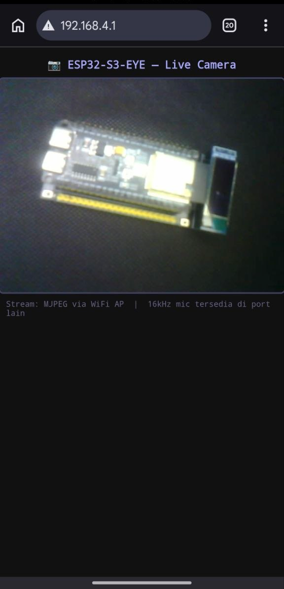

# 06 — Camera Stream (Live via Browser)

Live stream kamera ESP32-S3-EYE ke browser HP atau PC via WiFi. Program secara otomatis mendeteksi tipe sensor kamera dan melaporkannya di Serial Monitor.

Tidak perlu koneksi ke router — ESP32 membuat WiFi sendiri (Access Point mode).

> **Hasil pengujian:** Sensor kamera pada board ini adalah **OV2640** (PID: `0x26`) — terkonfirmasi berjalan normal.

---

## Hardware — Pin Kamera

| Sinyal    | GPIO | Sinyal   | GPIO |
|-----------|------|----------|------|
| XCLK      | 15   | D0 (Y2)  | 11   |
| SIOD (SDA)| 4    | D1 (Y3)  | 9    |
| SIOC (SCL)| 5    | D2 (Y4)  | 8    |
| VSYNC     | 6    | D3 (Y5)  | 10   |
| HREF      | 7    | D4 (Y6)  | 12   |
| PCLK      | 13   | D5 (Y7)  | 18   |
| PWDN      | —    | D6 (Y8)  | 17   |
| RESET     | —    | D7 (Y9)  | 16   |

---

## Arduino IDE Settings

> **Wajib** — kalau salah, kamera tidak akan berjalan.

| Setting              | Nilai                            |
|----------------------|----------------------------------|
| Board                | ESP32S3 Dev Module               |
| Port                 | COM5 (sesuaikan)                 |
| Upload Speed         | 921600                           |
| USB Mode             | Hardware CDC and JTAG            |
| **PSRAM**            | **OPI PSRAM**  ← wajib!          |
| **Partition Scheme** | **Huge APP (3MB No OTA/1MB SPIFFS)** ← wajib! |

---

## Cara Upload & Pakai

### Step 1 — Upload

1. Buka `06-camera-stream.ino` di Arduino IDE
2. Set **PSRAM = OPI PSRAM** dan **Partition = Huge APP** (lihat tabel di atas)
3. Klik **Upload**

### Step 2 — Cek Serial Monitor

Buka Serial Monitor (baud **115200**). Tunggu output seperti ini:

```
╔══════════════════════════════════════╗
║  ESP32-S3-EYE  ─  Camera Stream     ║
╚══════════════════════════════════════╝
Inisialisasi kamera... OK
Sensor PID: 0x26  → OV2640 ✓

╔══════════════════════════════════════╗
║  KAMERA SIAP — CARA AKSES:           ║
╠══════════════════════════════════════╣
║  WiFi SSID : ESP32-S3-EYE-CAM        ║
║  Password  : 12345678                ║
║  URL       : http://192.168.4.1      ║
╠══════════════════════════════════════╣
║  1. Sambung HP/PC ke WiFi di atas    ║
║  2. Buka browser, ketik URL di atas  ║
║  3. Nikmati live stream kamera!      ║
╚══════════════════════════════════════╝
6:28:34.895 -> [STATUS] Klien terhubung: 1
06:28:38.924 -> [STATUS] Klien terhubung: 1
06:28:38.924 -> [STATUS] Klien terhubung: 1
06:28:42.899 -> [STATUS] Klien terhubung: 1
06:28:42.899 -> [STATUS] Klien terhubung: 1
06:28:44.920 -> [STATUS] Klien terhubung: 1
06:28:46.946 -> [STATUS] Klien terhubung: 1
```

### Step 3 — Buka di Browser

1. Di HP atau PC, sambungkan ke WiFi **`ESP32-S3-EYE-CAM`** password **`12345678`**
2. Buka browser, ketik: **`http://192.168.4.1`**
3. Live stream muncul otomatis

> Bisa dibuka dari HP sekalipun — tidak perlu PC.

---

## Deteksi Sensor Kamera

Program otomatis membaca ID sensor dan menampilkan hasilnya:

| Output Serial                  | Artinya            |
|--------------------------------|--------------------|
| `Sensor PID: 0x26 → OV2640 ✓` | **Kamera OV2640** — terkonfirmasi pada board ini |
| `Sensor PID: 0x76 → OV7670`   | Kamera OV7670      |
| `Sensor PID: 0x36 → OV3660`   | Kamera OV3660      |
| `GAGAL (0x...)`                | Lihat troubleshoot |

**Board YD-ESP32-S3-EYE ini menggunakan OV2640** (PID `0x26`), resolusi maksimal VGA (640×480) dalam mode JPEG.



---

## Troubleshoot

| Masalah | Solusi |
|---------|--------|
| `Inisialisasi kamera... GAGAL` | Pastikan **PSRAM = OPI PSRAM** dan **Partition = Huge APP** |
| LED berkedip cepat setelah upload | Error kamera — cek setting PSRAM/Partition |
| Browser tidak bisa buka URL | Pastikan HP/PC sudah terhubung ke WiFi `ESP32-S3-EYE-CAM` |
| Gambar patah-patah / lambat | Normal untuk WiFi AP — pindah lebih dekat ke board |
| Gambar terbalik | Ubah `s->set_vflip(s, 1)` atau `s->set_hmirror(s, 1)` di sketch |
